# Getting Started Guide

## Onboarding to NHLBI BioData Catalyst Powered by Seven Bridges

_This guide aims to help you create an account on NHLBI BioData Catalyst powered by Seven Bridges and learn the basics of creating a workspace \(project\), running an analysis, and searching the hosted data. For more information, please refer to the platform documentation at_ [_http://sb-biodatacatalyst.readme.io/docs_](http://sb-biodatacatalyst.readme.io/docs)_._

## Accessing hosted TOPMed datasets on BioData Catalyst

BioData Catalyst hosts a number of controlled datasets from the Trans-omics for Precision Medicine \(TOPMed\) initiative. These datasets are stored in Amazon Web Services \(AWS\) and Google Cloud storage buckets operated by NHLBI such that the BioData Catalyst ecosystem enables users to access the same copy of the data. Access to these hosted datasets is controlled programmatically by services within the BioData Catalyst ecosystem for user authentication and authorization. **Users log into BioData Catalyst platforms using their eRA Commons credentials and authentication is performed by iTrust.**

The BioData Catalyst ecosystem manages user access to the hosted controlled data using data access approval from the NIH Database of Genotypes and Phenotypes \(dbGaP\). Therefore, users who want to access one or more of the hosted controlled studies on the ecosystem must be approved for access to that study in dbGaP. Principal Investigators who have approved Data Access Requests \(DARs\) on dbGaP for the BioData Catalyst datasets will be able to programmatically access those data on the platforms and services within the BioData Catalyst ecosystem.

Principal Investigators with an approved DAR can enable their lab staff to access the hosted datasets on the BioData Catalyst ecosystem by giving the lab staff “designated downloader status” on dbGAP. These individuals must:

* Have an eRA commons account or an NIH username and password. Please see these [instructions](https://era.nih.gov/commons/%23Commons/1_Admin/mgacct_create.htm%3FTocPath%3D_____24).
* Log in to dbGaP at least once.

To give lab staff downloader status, please refer to these [instructions](https://www.youtube.com/watch?v=Yem3OH26kX4&t=1s). **Please note that having other researchers listed on your dbGaP DAR application as internal and external collaborators will not result in these individuals getting access to hosted dataset on BioData Catalyst.** PI’s will need to add internal collaborators from their dbGaP application to the list of designated downloaders as described above. In addition, external collaborators will need to go through this same process for those at their own institution.

Researchers also have the option to bring their own datasets to the BioData Catalyst platforms. As described in the [BioData Catalyst Data Use Policy,](https://biodatacatalyst.nhlbi.nih.gov/resources/data/) users can upload data for which they have the appropriate approval provided that they do not violate the terms of their Data Use Agreements, Limitations, or Institutional Review Board policies and guidelines. To learn more about how to bring your own data to the platform, please refer to the [Documentation](https://sb-biodatacatalyst.readme.io/docs/upload-to-the-platform).

## Account Registration on BioData Catalyst powered by Seven Bridges

To create an account, please visit the [platform login page](https://platform.sb.biodatacatalyst.nhlbi.nih.gov/). Then, please select “Create an account.”

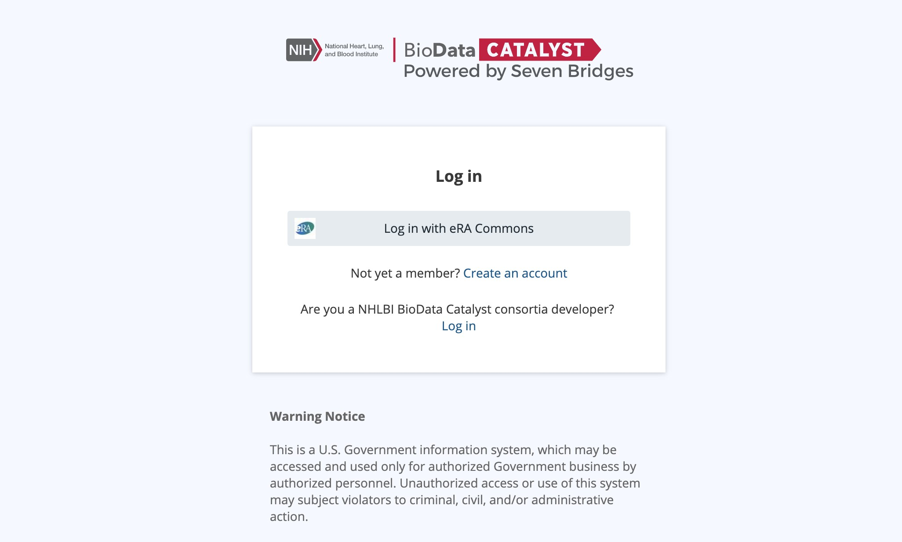

Accounts should be created with eRA Commons credentials. Select “Continue with eRA Commons.”

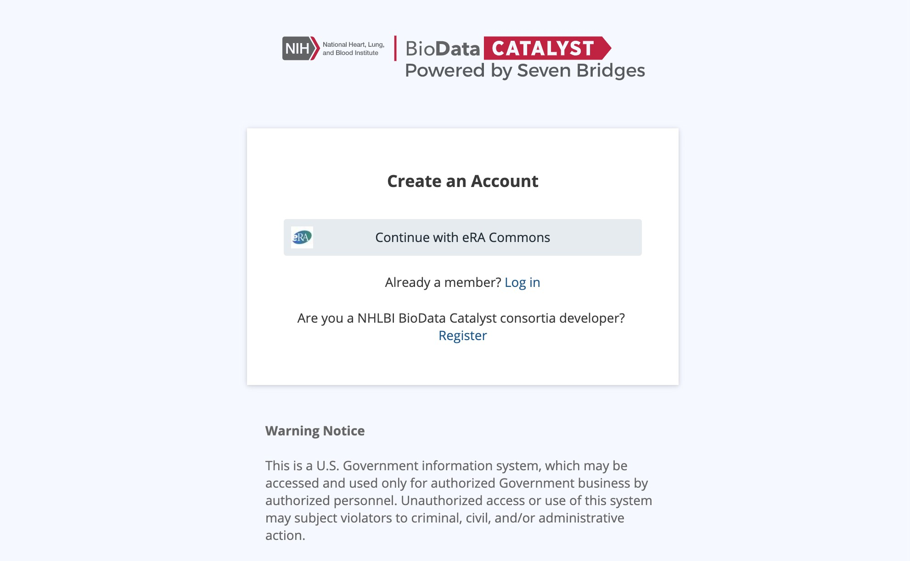

The platform will redirect you to iTrust where you can enter your eRA commons credentials.

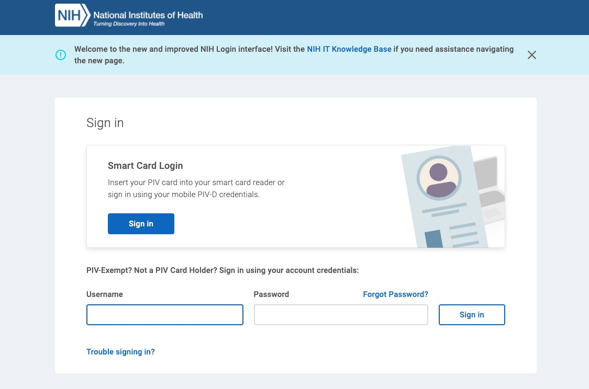

After you submit your eRA Commons credentials, the system will redirect you to the BioData Catalyst Gen3 service which manages user authentication and authorization. Please select “Yes, I authorize.”

Then you will be directed to the account registration page. For platform username, we suggest using “firstnamelastname” or “firstname.lastname” since this will make it easier for other platform members to search for you in the collaboration feature.

After clicking “Proceed to the platform,” the system will verify your email. You will receive $500 in pilot credits upon account creation so you can start testing out the platform and running analyses.

The Seven Bridges team is eager to help you get the most out of using the platform. We would like to hear about your analysis plans so that we can support your research to the best of our abilities. This includes but is not limited to: a platform demo; recommendations on the hosted bioinformatics tools/workflows; tips for accessing the hosted datasets or uploading your own data; and a tailored in-depth training over web call. If you already have a research project planned on the platform, please email the Seven Bridges Program Manager for BioData Catalyst, Alison Leaf \([alison.leaf@sevenbridges.com](mailto:alison.leaf@sevenbridges.com)\).

## Controlled data questionnaire

For users who are approved to access controlled hosted data on BioData Catalyst, like the TOPMed studies, you will be prompted to take a “Controlled data questionnaire” the first time you login. Please refer to the explanations below for filling out the questionnaire. If you have any questions, don’t hesitate to reach out to the Seven Bridges Program Manager Alison Leaf \([alison.leaf@sevenbridges.com](mailto:alison.leaf@sevenbridges.com)\).

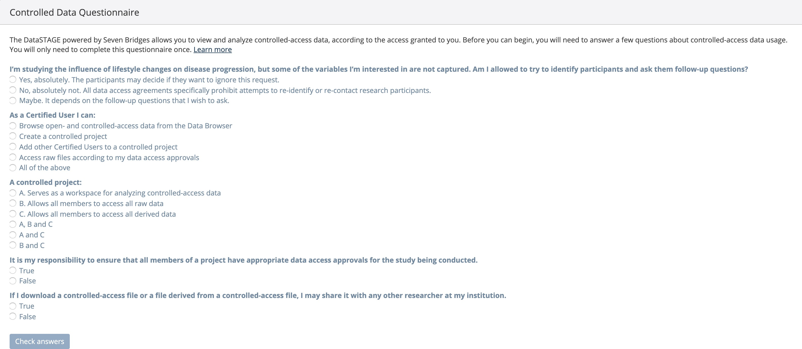

**Projects:** Projects are workspaces that serve as containers for files, bioinformatics tools and workflows, and analyses. Users can create projects and add collaborators to those projects with specific permissions for what those collaborators are able to see and do within the project.

**Raw data:** This refers to the hosted datasets on the platform. Access to these raw files is controlled programmatically by the platform such that users are only able to access files they have approval for. The hosted data is available for search via the Data Browser feature. The Data Browser feature has both open and controlled datasets available for search. Users can select files from the hosted datasets to add to projects and then use them in analyses. The platform only lets users add files to projects if they are approved to access those files. In addition, once a raw file has been added to a project, users are only able to use those raw files in an analysis if they are approved for access.

**Derived data:** Derived data are the output files from running a bioinformatics tool or workflow. These files are stored in the projects where the analyses were run. All members of

a project are able to access the derived data files within a project. The platform does not control a user’s ability to access derived data apart from who is a member of a given project.

**Certified user:** A user on the platform who is approved to access hosted controlled data.

**Controlled project:** When users create new projects, they have the option to set the project as a “Controlled project.” The purpose of Controlled projects is to help users protect Controlled data by restricting access to users who have the necessary approvals to work with that data. If users want to work with hosted controlled data from the Data Browser feature, then the user must add those controlled data files to a Controlled project. In addition, the project owner \(and other admins\) can only add new members to the project if those members also have access to Controlled data on the platform. Members of Controlled projects can see a list of all the files in that project, however, they are only able to access raw files \(use the file as an input in a tool or workflow\) if they have appropriate access approval. All project members can access derived data.

## Check data access permissions on BioData Catalyst

BioData Catalyst programmatically controls user permissions on the hosted controlled datasets like the TOPMed studies. To see which of the hosted datasets you are approved to access on BioData Catalyst, click on your username in the top right-hand corner of the platform. From the drop-down menu, select “Account Settings” and then select the tab for “Data Access.” This will bring you to a page that lists all of the datasets that are hosted on BioData Catalyst and show green check marks next to the ones that you are authorized to access on the platform. Please verify that there are green check marks next to the datasets that you expect to have access to. The datasets are referred to using their dbGaP phs numbers and consent codes. If you don’t see what you expect, please contact Alison Leaf \([alison.leaf@sevenbridges.com](mailto:alison.leaf@sevenbridges.com)\).

The example user shown below has access to all of the hosted TOPMed studies, however, please note that your data access should match up with what you have access to in dbGaP.

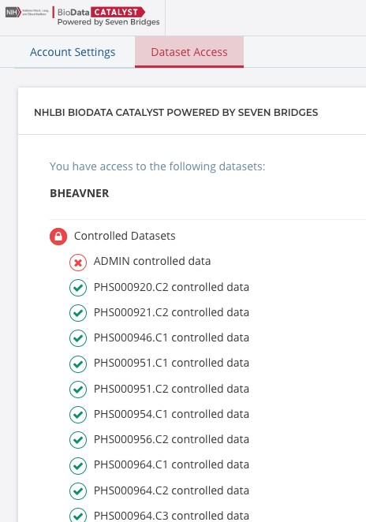

## Create a project

Projects are workspaces that serve as the core building blocks of _BioData Catalyst powered by Seven Bridges_. Each project corresponds to a distinct scientific investigation and serves as a container for data, analysis workflows, and results. Multiple analyses can be carried out within a project.

Projects are secure and private. The project creator has the option to add collaborators to the project as project members. Each project has at least one administrator, who controls the project members' permissions to execute analyses. You can be a member of multiple projects each with different teams of researchers.

Let’s create a project to learn more about the options for how they can be configured. On the main dashboard, select “Create a project.”

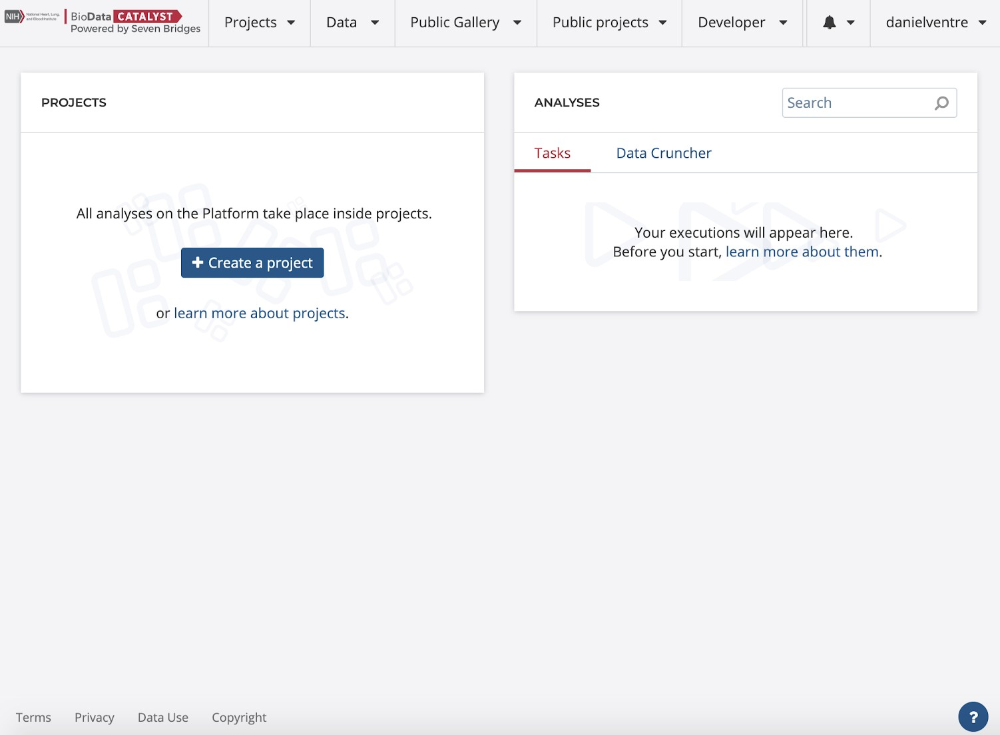

### 1. Name the project

Following along with the red step indicators in the screenshot above, begin by picking a name for your project. Your project will be assigned a short name based on the name that you give it, which is used as an ID to refer to the project when using the API.

### 2. Billing group

Billing groups are used to track the costs associated with cloud storage and computation on the platform. Each project must be assigned a billing group. Each user has a “Pilot Funds” billing group with $500 in cloud credits to get started with analyses. The Seven Bridges Support Team will reach out when a user is close to using up their Pilot Funds and offer to create a new billing group for further work. If you already have a project planned, please reach out to the Seven Bridges Program Manager Alison Leaf \([alison.leaf@sevenbridges.com](mailto:alison.leaf@sevenbridges.com)\) for assistance. For this example project, select the Pilot Funds billing group.

### 3. Location

To enable users to compute on data where it lives, the platform offers the choice to perform computation on two different cloud locations \(cloud provider and region\): AWS us-east-1 and Google us-west-1. Users select one of these two cloud locations as the location for the project. All computation within the project will take place on this cloud location, and any resulting files from analyses will be stored on this cloud location. While users can set up analyses with input files from any cloud location, if the input files are stored on a different cloud location than the one set for the project, data egress will occur. Therefore, it is typically most efficient to select the cloud location based on where a majority of the input files are stored. [More information can be found in this blog post](https://www.sevenbridges.com/be-cloud-agnostic/).

For users who will analyze the hosted TOPMed CRAM or VCF files, either cloud location can be used because the datasets are stored on both AWS us-east-1 and Google us-west-1.

If users have their own private data in a cloud bucket \(AWS or Google\), it can be connected to the platform. For these analyses, users will likely want to select the cloud location based on the location of the private cloud storage bucket.

For this **example project**, select AWS-us-east-1 as the cloud location.

### 4. Execution Settings

The first selection in the Execution Settings is whether to use a discounted type of computation instance on AWS or Google Cloud, which uses the cloud provider’s spare capacity. For AWS, the platform supports EC2 Spot instances. With Spot instances, you pay the Spot price that is in effect for the time period your instances are running. Spot instance prices are set by Amazon EC2 and adjust gradually based on trends in supply and demand. Spot Instances are available at up to a 90% discount compared to On-Demand prices. For Google, the platform supports Preemptible instances. They offer the same machine types and options as regular compute instances and last for up to 24 hours. Pricing is fixed so you will always get low cost and financial predictability, without taking the risk of gambling on variable market pricing. Preemptible instances are up to 80% cheaper than regular instances.

Both AWS and Google may terminate these instances at any time if they require access to those resources due to high demand. The job\(s\) running on the instance at the time of termination will be interrupted and have to be run again from the beginning. The jobs will be automatically restarted on an equivalent regular On-Demand instance to minimize time wasted in completing your analysis. Restarting jobs on another instance will inevitably prolong execution time and add to the cost. **Therefore, these instances are not recommended for running long, time-critical jobs.**

For this **example project**, turn on AWS Spot instances.

The next selection for Execution Settings is whether to use memoization when running analyses. Memoization allows researchers and bioinformaticians to restart from a point of failure in a workflow by enabling the reuse of existing outputs. This memoization feature is currently in beta stage and you can read more about it on the [Seven Bridges blog](https://www.sevenbridges.com/memoization/).

For this **example project**, leave memoization in the default “off” setting.

### 5. Controlled Projects

Projects can be set as either “Open” or “Controlled.”

Open Data Projects are designed to host both **Open Data** and **your private data**. Open Data is available to all the users on the Platform and consists of data which is not unique to an individual, such as de-identified clinical data, gene expression data, copy number alterations in regions of the genome, epigenetic data, and summaries of data compiled across individuals. Note that you cannot copy Controlled Data inside an Open Data Project.

Controlled projects help users protect hosted **Controlled Data** \(like the TOPMed studies\) by restricting access to other users who also have approval to work with one or more of the hosted controlled datasets. If users want to work with hosted controlled data from the Data Browser feature, then the user must add those controlled data files to a Controlled project. In addition, the project owner \(and other admins\) can only add new members to the project if those members also have access to Controlled data on the platform. Members of Controlled projects can see a list of all the files in that project, however they are only able to access raw files \(use the file as an input in a tool or workflow\) if they have appropriate access approval. All project members can access derived data.

For this **example project**, leave the box unchecked so that the project will be “Open.”

## Running analyses

Single executions of bioinformatics tools and workflows on the platform are called “Tasks.” All Tasks are run from within projects. We will set up an example Task using the **FastQC workflow**.

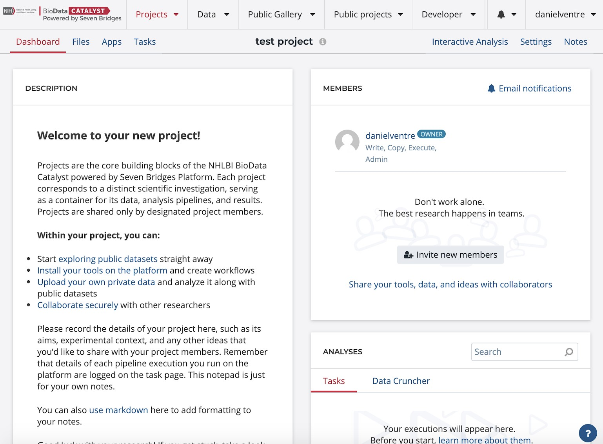

Let’s start by adding files to the project. Go to the **Files tab** at the top and then select “Add Files.” This will bring you to the page shown below where you can select from “Public Files” that Seven Bridges makes available or files that are in your other projects. In addition, researchers can upload/import files to the platform using “FTP/HTTP,” the “Data Tools” or the “Volumes” feature which enables connecting private cloud storage to the platform.

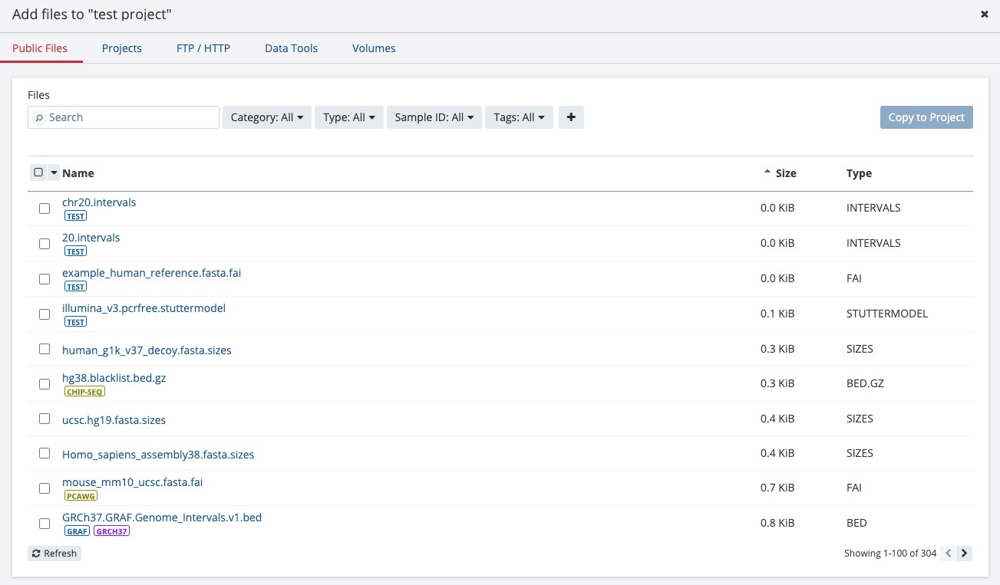

For this example Task, let’s search for FASTQ files. Using the “Type” category, check the box next to “FASTQ” to filter for only FASTQ files within the Public Files.

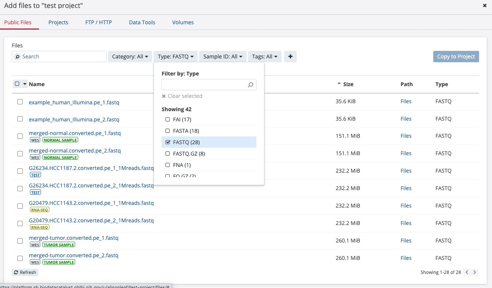

Now select “example\_human\_Illumina.pe\_1.fastq” and “example\_human\_Illumina.pe\_2.fastq” and click the blue “Copy to project” button in the upper right corner. A small box will pop up giving you the option to add tags to these files. Simply click “Copy.” Now these files have been added to your project. These are soft links to the files in the Seven Bridges storage so you do not accrue any cost for having them in your project.

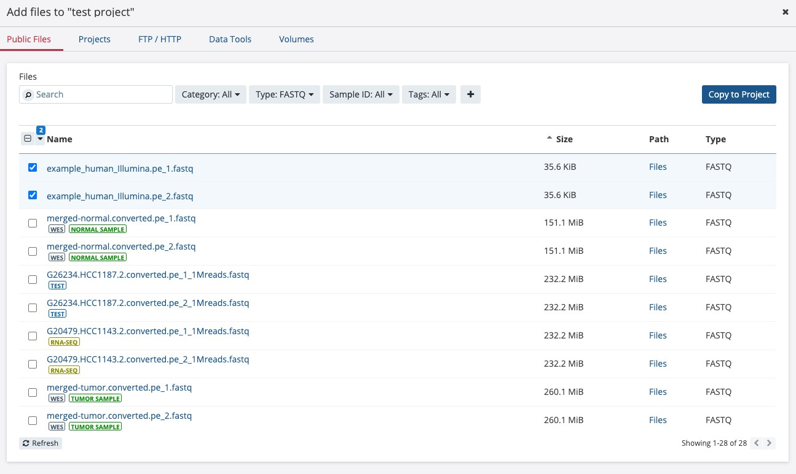

After adding Files to the project, the user can go to the Apps tab and select “Add app” \(red arrow\). Apps is the platform term for tools and workflows.

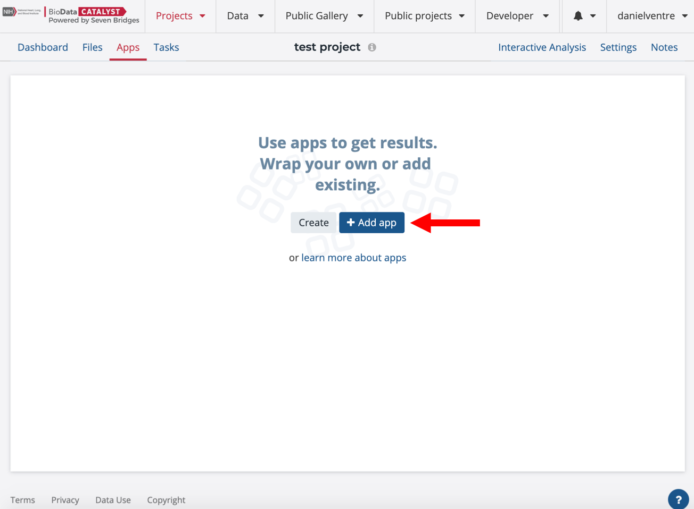

Users have the option to run hundreds of hosted tools and workflows that can be found under the “Public Apps” tab. Tools are denoted with a purple “T” and workflows are denoted with a yellow “W.” All tools and workflows are in the Common Workflow Language \(CWL\) which is both human and machine-readable and has all the necessary information to run the tool in a reproducible way. Users also have the option to bring their own tools and workflows to the platform using Docker and our SDK. Please reach out to the Seven Bridges team if this is of interest to you.

Search for the **FastQC workflow** in the Public Apps and then select to “Copy” this workflow to your project. **Please note:** when you select the “copy” button shown above by the red arrow, the App URL is displayed, and a second row of buttons appears prompting you to “cancel” or “copy.” Hitting “copy” again then copies your app to your project, and a banner notification appears to confirm. Select the “x” in the top right corner to go back to the Apps tab of the project.

Please note that for each of the hosted tools and workflows in the Public Apps, users can see a description of the tool/workflow along with helpful information like the required inputs, outputs, and common issues \(see below\).

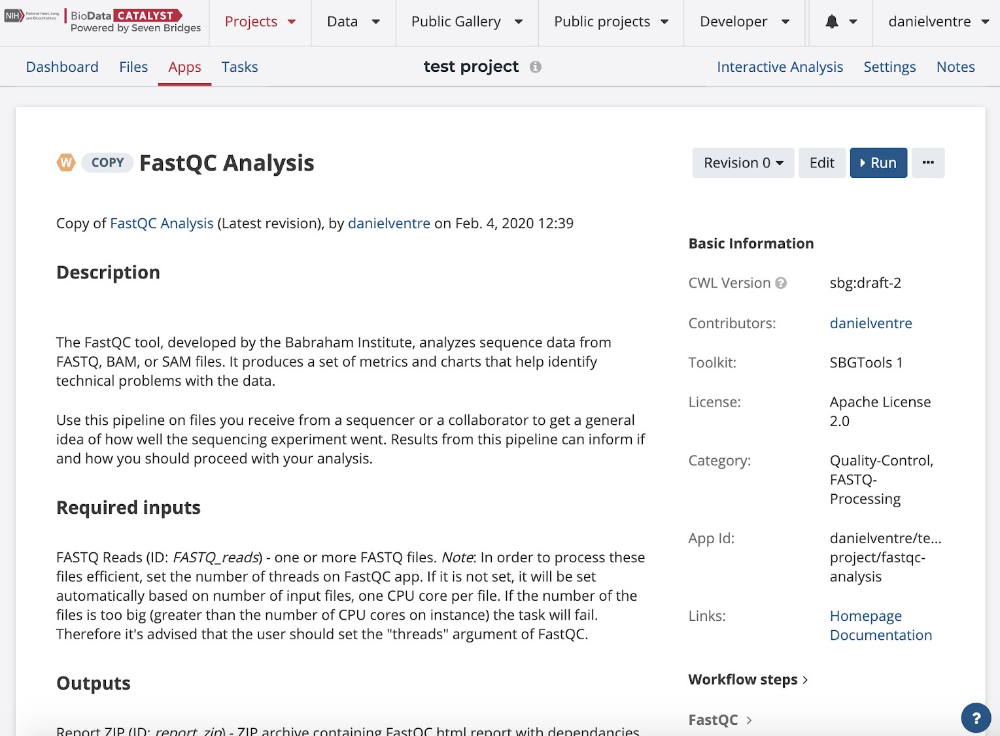

To set up the draft Task, select “Run” on the App from the Apps tab. This will bring you the screen where you will select your input files. When selecting input files for this run, only the FASTQ read files are required. Then click “Run” and your Task will queue up to Run. The completed Task and output file links are shown in the second image.

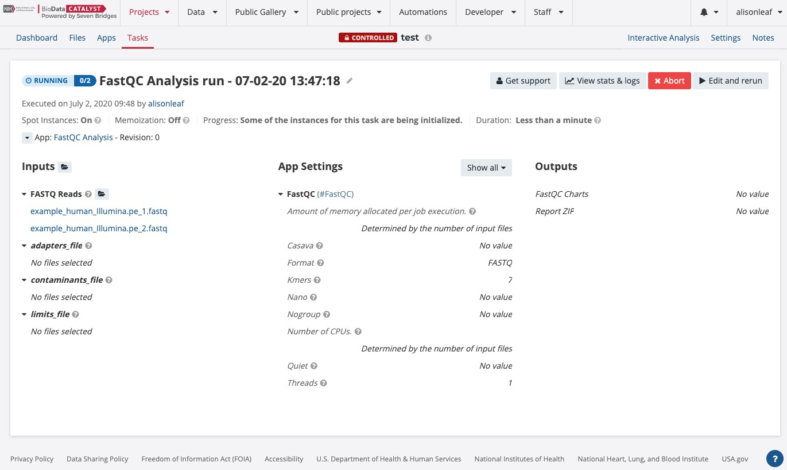

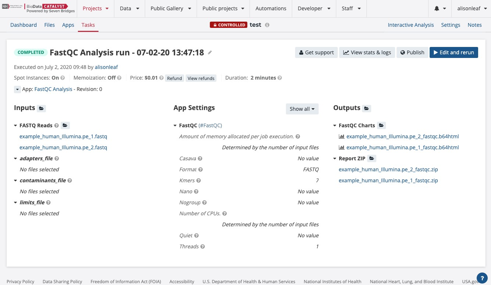

## Search and access hosted TOPMed studies

If you would like to work with the hosted TOPMed studies \(or see the list of available studies\), navigate to “Data” on the top menu bar and then select the **Data Browser**. This will bring you to a page that shows the hosted TOPMed studies listed by disease type. TOPMed studies with genomic data are prefaced by “NHLBI TOPMed: XX” and are listed next to any associated parent study. The phs numbers are listed for each study. Select “Details” to expand the box and see the consent groups for each study. For the TOPMed studies, you can see the total number of files, samples, and subjects. For the parent studies, the total number of files available is listed.

BioData Catalyst hosts multi-sample VCF files from TOPMed Freeze8 and the raw clinical files for these studies. These files are available per study and per consent group. These are the same files that a user would find in the dbGaP accession for the particular study except that BioData Catalyst hosts un-tarred versions of the files whereas dbGaP offers tarred versions. BioData Catalyst also hosts CRAM files and single-sample VCF files for all subjects. Users can also find multi-sample VCFs from TOPMed Freeze5 and these are in the tar format like dbGaP. Follow the instructions below to see how to find specific file types for a TOPMed study and consent group.

Starting from the dataset selection page, select the study “NHLBI TOPMed: The Jackson Heart Study.” All TOPMed studies \(genomic data\) have the preface “NHLBI TOPMed” in the name. We will query only one dataset, however, users have the option to select several hosted studies at once. Click “Explore 1 selected” to go to the query page of the Data Browser.

From the query page, users can see the list of active datasets on the left-hand side. They can search over several different entities to find files on the platform including Subject, Sample, and File. Each of these entities has a number of properties that you can filter through to search the file metadata. Select the File entity to begin this search. Your screen will look like the second image below.

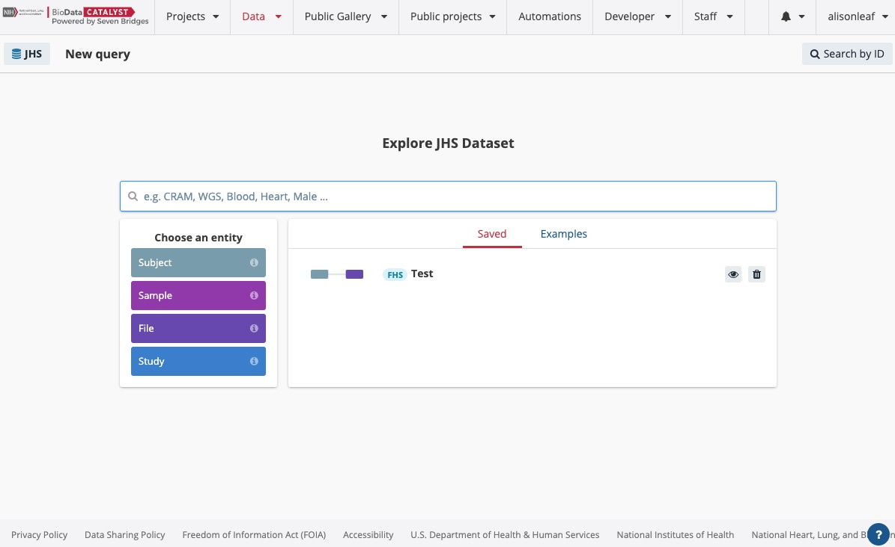

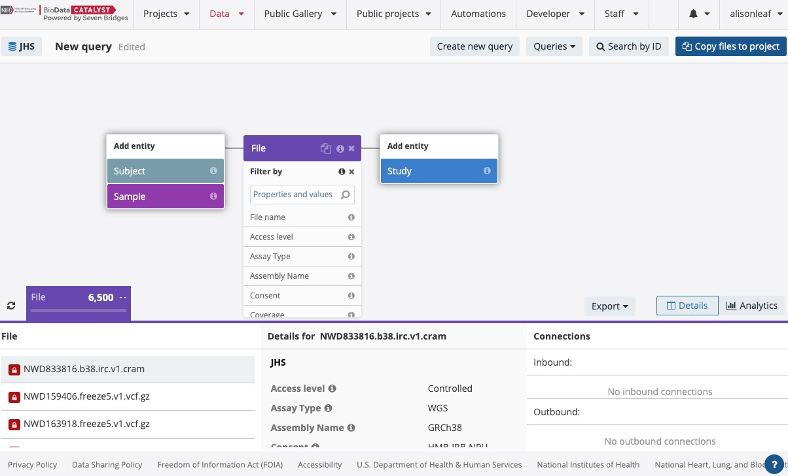

Now you can select the consent group you want to work with. In the File entity, select the “Consent” property. All of the consent groups in the selected study will be listed as shown below:

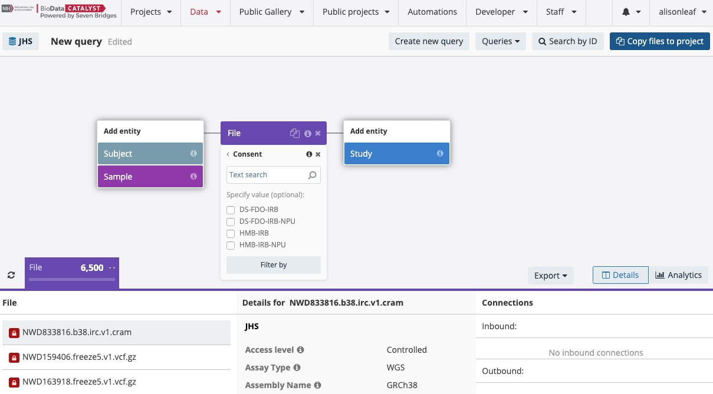

As an example, select HMB-IRB and “Filter by.” Now add the Property “Data Type,” which will show the 4 different types of files for this study: 

* Aligned reads \(CRAMs\)
* Simple Germline Variation \(single-sample VCFs\)
* Unharmonized Clinical Data \(phenotype files for each study consent group\)
* Variant Call \(multi-sample VCFs separated by chromosome for each study consent group\)

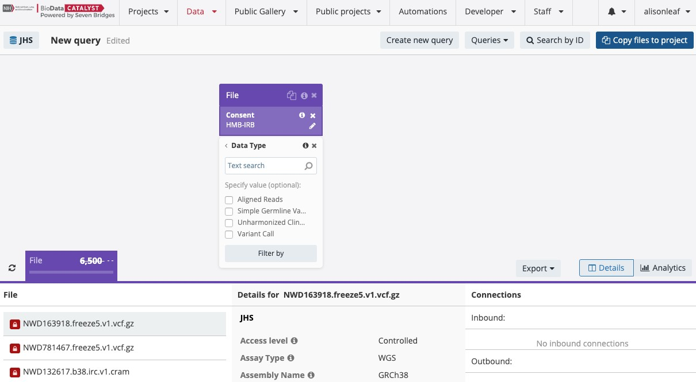

Select Aligned Reads and “Filter by” to find the CRAM files for this study and consent group. It is important to refresh the results in the lower left corner next to the file tab. This will show the total number of CRAM files for this study and consent group on BioData Catalyst.

To find the multi-sample VCF files from TOPMed Freeze8, edit the “Data Type” field of the above search. Check the box next to Variant Call instead of Aligned Reads. To search specifically for Freeze8 data and eliminate Freeze5 data from your search, add the “Freeze” property to the search.

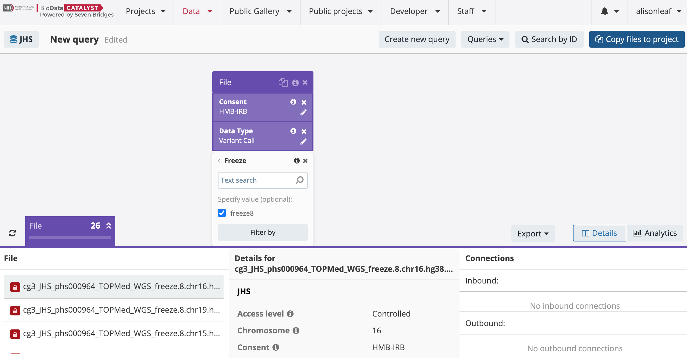

Filter by Freeze8 and refresh the results in the lower-right corner above the list of file names. For the Jackson Heart Study consent group HMB-IRB, you will now have found 23 multi-sample VCF files from TOPMed Freeze8, one for each chromosome.

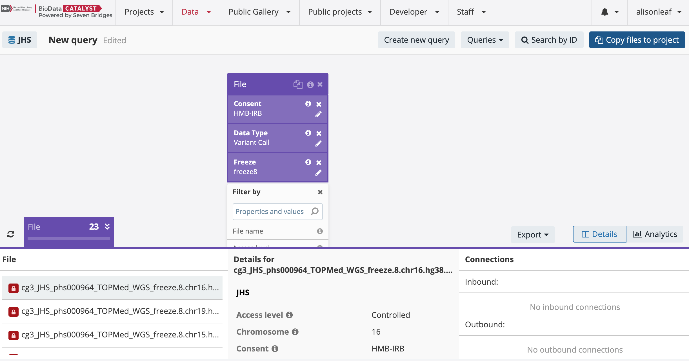

The file names identified are listed in the bottom part of the page with red lock symbols next to them to indicate that they are controlled files. To link these files to a project for analysis, select “Copy files to project” in the upper right-hand part of the page. **Please note that users can only link files to a project if they are approved to access those files on dbGaP.** Therefore, if you are not approved for the “NHLBI TOPMed: The Jackson Heart Study” consent group HMB-IRB, the platform will prevent you from bringing these controlled files to a project. **Because these are controlled files, they must be linked to a project marked as controlled.**  

Only open access metadata is available for users to search over in the Data Browser, so all BioData Catalyst users can view all available studies on BioData Catalyst and perform the same searches.   
  
****

