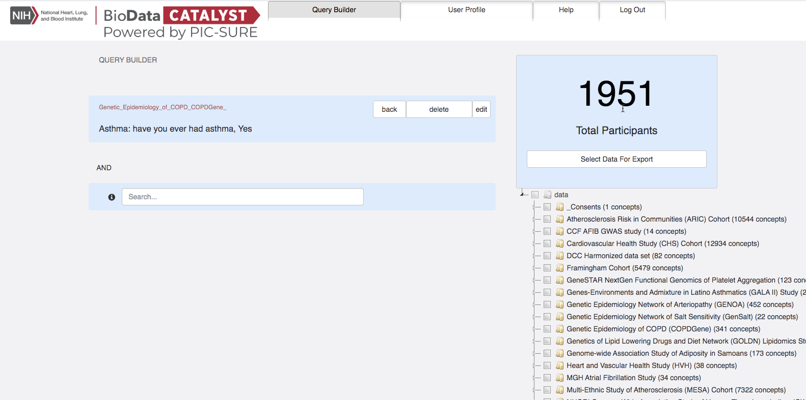
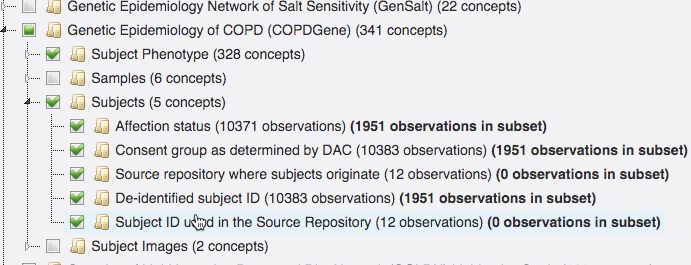
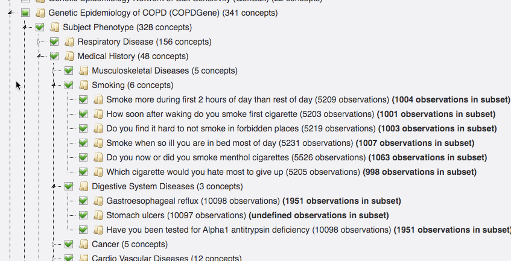
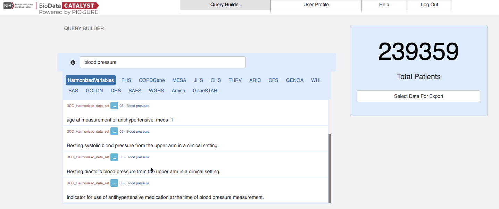
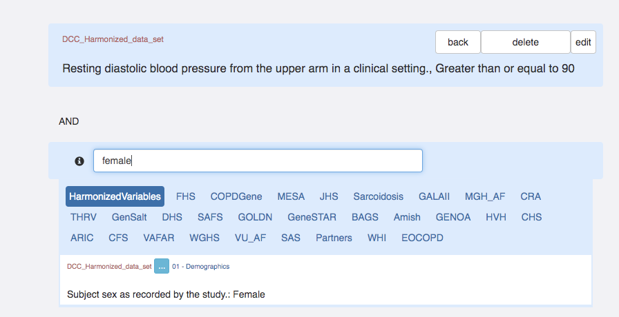

# Search

This section will outline the following:

1. Overview of PIC-SURE search layout
2. One criterion search
3. Multiple criteria search: \(i.e.: age and disease\)
4. Search using harmonized variables

### Search Layout

Once you have logged in to the PIC-SURE User Interface, you will see the total number of participants available based on the data you can access. Additionally, from here you can also navigate to the list of studies you are authorized to access.

To see a list of studies you have access to click select data for export which will bring down a data tab. Click on the small triangle to expand the tree and see a listing of all studies.

To begin your query, type directly into the search bar. For example, if you were interested in asthma you can start your search by typing the word “**asthma**” into the search box and hit enter to begin the search. All studies that include “asthma” will be displayed. This includes cases where the word “asthma” is in the variable name, or where “asthma” is in the results \(the value for the variable\).

Below is an example of searching for “**asthma**.” There are 3 main fields where you can.

1. Shown with the black arrow, the display shows the abbreviated study name. You can toggle between studies to see the specific variables available for each study. This example shows that we are currently viewing data for the FHS study, which is the abbreviated name for The Framingham Heart Study. A full list of abbreviations and full study names is located [he]()[re](). Additionally, if you know you are interested in a specific study, you can type in either the full or abbreviated study name and results for that study will be displayed.
2. Shown with the purple arrow, for each study there are different subsets of data available. For example, here for the Framingham Heart Study we can choose to look at the variables under all results or we can select to look at a subset such as the Clinical Questionnaire.
3. Shown with the blue arrow, are the actual variables. Given our search of “asthma” we can drill down further and select the specific variable we are interested in viewing the results for. Once you select the variable of interest the number of participants with data for that variable will be displayed.

### One-Criteria Search

Once you determine the variables and studies you are interested in you can further refine your query to find the number of patients available in the cohort. For example, after looking through the various studies and variables, you want to build a cohort of individuals who have had asthma. You can type in “**asthma**” and find the relevant variables. You can choose “Have you ever had asthma”

Clicking on the variable name allows for further refinement of your query. All available values are included here. For this variable, the available values are “Yes”, “No”, and “I don’t know.”: If you are interested in those individuals who have had asthma you can filter by clicking the “Yes” and adding this to the selected values.

The user can then select to run the query. This will return the total number of participants in the COPDGene study who have identified as having had asthma.

If you are done with your query, you can then click on the “**Select Data For Export**” button. This will produce a tree showing the underlying data. Click the small triangle to expand the tree with the underlying data.

Clicking this brings shows the user a full listing of the available studies and data; however, only the available concepts/variables that match the search criteria for each study will be available. In this case we would scroll to the COPDGene study to retrieve the data of interest.

## As you look at the available data for export, you can see there are 341 concepts \(variables\) available in this COPDGene and 1,951 observations that match our 1,951 participants that stated they have asthma are available.

For my analysis I’m only interested in the phenotype data and subject specific data so I will unclick the other boxes and choose to “**Prepare Export for Analysis**.”

Note while I’m selecting all subject phenotype data, I have the ability to keep or remove any of the variables. I can do this by expanding the tree. For example, if I am not interested in retrieving data for stomach ulcers I could remove that from my data by unchecking the box next to this variable.

Based on my selection of all available variables for the COPDGene study. The platform will then prepare a list of subject identifiers and all phenotypic variables \(328 concepts/variables\) and Subjects variables \(5 concepts/variables\) for the study for all participants \(n=1,951\) who answered yes to the question “Ever had asthma.” I then have the option to download the data to a csv for analysis. Additionally, the system assigns a query Id that can be used in conjunction with the PIC-SURE API to import the data into another BioData Catalyst platform for analysis such as Seven Bridges or Terra using a Jupyter Notebook. This query ID can also be used in PIC-SURE later, serving as a reference for the user to return to previously built queries in PIC-SURE. NOTE: As you click to “**Prepare for Export** '' you will have to scroll all the way down to the bottom of the screen to see when it is available.

### Multiple-Criteria Search

You can add elements to your query to further refine your cohort. Going back to the original query of looking at the COPDGene study answered “Yes” to ever had asthma. We can add other variables to this.

Adding to this query. I want to also look at variables around smoking by typing the word “**smoke**.”

I want to continue looking at the COPDGene study and want to look at the variable “Have you ever smoked cigarettes” and will filter on “Yes”

The results are updated based on the addition of the new variable.

In most cases, when looking at unharmonized data there is not the ability to combine studies when performing a query because participants will not be found in multiple studies. To obtain data from multiple studies it is best to conduct separate queries for each, then combine files at the time of analysis. As a note of caution, there are limited harmonized variables currently available. Combining data from multiple studies needs to be done with care and in conjunction with using the study documentation and data dictionaries to ensure you are comparing similar variables.

### Harmonized Variable Search

There are limited amounts of harmonized data available at this time. The TOPMed Data Coordinating Center curation team has identified forty-four \(44\) variables that are shared across seventeen \(17\) NHLBI studies and has normalized the participant values for these variables. See the section on [Harmonized Data]() for more information about harmonized variables.

To search for harmonized variables, log-in to the PIC-SURE User Interface. Type in the variable of interest \([see list of harmonized variables]()\). This example uses Blood Pressure. Type “**blood pressure**” into the search bar.

When you hit enter, you will see the studies that contain the term blood pressure. When the term you searched is one of the harmonized variables and you have access to studies that include these harmonized variables. The first “study” that comes up is for the “**HarmonizedVariables.**” This will allow for you to search and refine cohorts using these terms, across all the harmonized studies that you are authorized to access.

I’m interested in exploring diastolic blood pressure. I can scroll through the options and I choose “_Resting diastolic blood pressure from the upper arm in a clinical setting_.”

Once I click that variable, it is automatically set to allow for me to restrict by a certain range. From this window, there is the option to not restrict at all. I’m going to choose not to restrict by a specific value to see how many participants I have in the harmonized dataset that have a resting diastolic blood pressure. This result gives the number of participants with a value for this variable across all the harmonized studies that you are authorized to access.

Once I run this query, I can see there are 209,785 total participants with results for this variable.

Now if I want to restrict the results further to narrow down the cohort. I can click edit and restrict by numeric value. I can see the values for the variable range from 0- max: 162.5. I can choose to restrict my numeric value, _pick either less, than or equal to 90_.

This result gives the number of participants with a resting diastolic blood pressure from the upper arm in a clinical setting for this variable across all the harmonized studies that you are authorized to access.

You can also further refine the query using the harmonized variables. For example, maybe you only want to study females and you restrict using the variable “**sex**” restrict by value by selcting females and runnning the query.

You could also query for this by typing “**female**” and selecting the “HarmonizedVariables” option.

Now that you have refined the query to have the criteria you need for your analysis, you can export the data. To export the harmonized variables go to “**Select Data For Export**”

This will produce a tree showing the underlying data. Click the small triangle to expand the tree with the underlying data.

Clicking the triangle to expand the tree displays a full listing of the available studies and data. To retrieve the harmonized variables, click the checkbox for “**DCC Harmonized data set**” From this menu you can select the variables of interest that you want to export. Based on my query I will choose blood pressure and demographic variables to export. Data exports will only include data from the harmonized studies the user is authorized to access.

